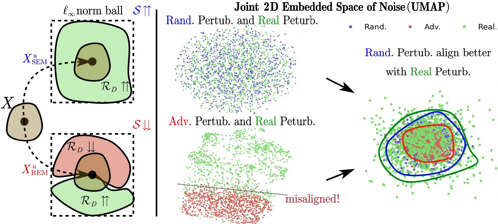

# Stable-Unlearnable-Example



The complete code is coming soon. On the implementation level, our work solely overwrites the `_get_adv_` [function](https://github.com/fshp971/robust-unlearnable-examples/blob/main/attacks/robust_workers.py) in `robust-unlearnable-examples/attacks/robust_workers.py` in the [REM code base](https://github.com/fshp971/robust-unlearnable-examples) with the following random perturbation process. 

```python
def _get_adv_(self, model, criterion, x, y,):
  adv_x = x.clone()
  if self.atk_steps==0 or self.atk_radius==0:
      return adv_x
  # "uniform" noise
  adv_x += 2 * (torch.rand_like(x) - 0.5) * self.atk_radius * self.uniform_scale
  self._clip_(adv_x, x, radius=self.atk_radius)
  return adv_x.data
```
